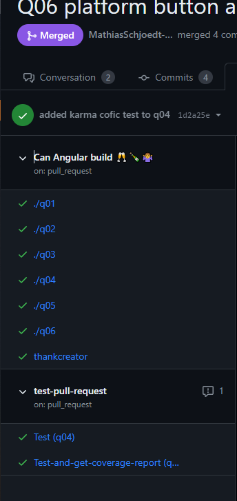
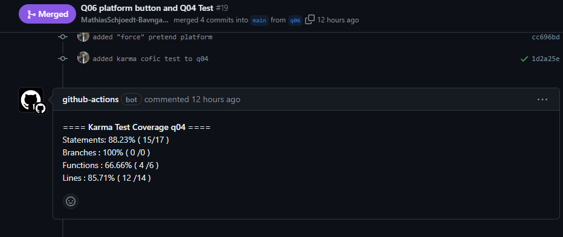

# Q04 Angular forms and testing

<!-- References to code will be made in markdown by using: See more in line XX in [name of snippet]("PATH_TO_FILE") -->

**Questions:**

- Explain template-driven forms in Angular
- Explain reactive forms in Angular
- Discuss the pros and cons on the different approaches
- Explain how to test Angular apps

Handling user input is the most crucial part of a web application. Angular provides two ways of handling forms: template-driven forms and reactive forms. Template-driven forms are the most common approach and are similar to AngularJS. Reactive forms are a newer approach and are more robust and scalable. The choice of form depends on the use case. Simple forms are easier to implement using template-driven forms while more complex forms are easier to implement using reactive forms. You should chooes a template form if everything can be done using the template. If you need more control over the form, you should choose a reactive form.

## Template-driven forms

Template driven forms are forms that are created using directives. Inside the HTML template, you add the directives and make sure that the form is valid. The form is then submitted to the component class where you can access the form data. Template-driven forms are asynchronous by nature. This means that the form data is not available until the form is submitted. Template-driven forms are also unstructured and mutable. This means that the form data can be changed at any time. Template-driven forms are also more difficult to test since the form data is not available until the form is submitted.

Some of the template directives are: NgForm, NgModel and NgModelGroup. When you import the FormsModule in your component, Angular automatically creates and attaches an NgForm directive to the `<form>` tag in the template (because NgForm has the selector form that matches `<form>` elements). This allows us to access the form data by adding a reference (f or some other name) to the form element: `<form #f="ngForm">`.

See more in line 13 in [Form reference](./src/app/template-driven/template-driven.component.html) and line 11 in [Importing the FormsModule](./src/app/app.module.ts)

The ngModel directive declared in the FormsModule lets you bind controls in your template-driven form to properties in your data model.

See more in line 25 in [Data binding](./src/app/template-driven/template-driven.component.html)

Template-driven forms let direct access modify data in your template, but are less explicit than reactive forms because they rely on directives embedded in the template, along with mutable data to track changes asynchronously.

When the user is done filling out the form and everything has been validated on the client, the user clicks the submit button which will trigger the onSubmit() method in the component class. The onSubmit() method will then access the form data using the reference to the form element and the ngModel directive.

See more in line 13 in [Form reference](./src/app/template-driven/template-driven.component.html) and line 77 in [Submit button](./src/app/template-driven/template-driven.component.html) and line 12 in [Submit form](./src/app/template-driven/template-driven.component.ts)

## Reactive forms

Reactive forms provide a model-driven approach to handling form inputs whose values change over time. Reactive forms are forms that are created in the corresponding component class. Reactive forms differ from template-driven forms in distinct ways. Reactive forms provide synchronous access to the data model, immutability with observable operators, and change tracking through observable streams. Each field that you want the user to type data into is made with a FormControl. The FormControl tracks the value and validation status of an individual form control. The FormGroup tracks the same values and status for a collection of form controls. The FormControl and FormGroup classes are used to create the data model. The data model is then bound to the template to keep the two in sync.

```typescript
import { Component } from '@angular/core';
import { FormGroup, FormControl } from '@angular/forms';
@Component({
  selector: 'app-profile-editor',
  templateUrl: './profile-editor.component.html',
  styleUrls: ['./profile-editor.component.css']
})
export class ProfileEditorComponent {
  profileForm = new FormGroup({
    firstName: new FormControl(''),
    lastName: new FormControl(''),
    address: new FormGroup({
      street: new FormControl(''),
      city: new FormControl(''),
      state: new FormControl(''),
      zip: new FormControl('')
    })
  });
  ...
}
```

However it is also possible to create the data model using FormBuilder. The FormBuilder service provides convenient methods for generating controls. The FormBuilder service is an injectable provider that has three methods `control()`, `group()` and `array()`.

```typescript
import { Component } from '@angular/core';
import { FormBuilder } from '@angular/forms';
...
@Component({
  selector: 'app-profile-editor',
  templateUrl: './profile-editor.component.html',
  styleUrls: ['./profile-editor.component.css']
})
export class ProfileEditorComponent {
  profileForm = this.fb.group({
    firstName: [''],
    lastName: [''],
    address: this.fb.group({
      street: [''],
      city: [''],
      state: [''],
      zip: ['']
    }),
...
  });
...
  constructor(private fb: FormBuilder) { }
...
}
```

See more in line 10 in [Formbuilder](./src/app/reactive/reactive.component.ts)

## Key differences

Setup of form model:

1. Template-driven forms: implicit, created by directives
2. Reactive forms: explicit, created in component class

Data model:

1. Template-driven forms: unstructured and mutable
2. Reactive forms: structured and immutable

Data flow:

1. Template-driven forms: Asynchronous
2. Reactive forms: Synchronous

Form validation:

1. Template-driven: Directives
2. Reactive: Functions

## Testing Angular Apps

Angular testing utilities are exported with the `@angular/core/testing` package. The TestBed is the most important of the Angular testing utilities. The TestBed is the first and most important of the Angular testing utilities. The TestBed creates a dynamically-constructed Angular test module that emulates an Angular @NgModule. The TestBed.configureTestingModule() method takes a metadata object that can have most of the properties of an @NgModule. The TestBed.configureTestingModule() method returns an instance of the TestBed class, which has methods for creating components and services from the classes in the test module. The TestBed.createComponent() method creates an instance of the component that is associated with the component class. The TestBed.createComponent() method returns a ComponentFixture, which is a handle on the component and provides access to the component instance itself and to the DebugElement, which is a handle on the component's DOM element. The TestBed.createComponent() method also triggers change detection.

See more in [app.component.spec.ts](./src/app/app.component.spec.ts)

## Ci testing with Karma and Jasmine

You can test in the CI e.g. Github Actions. This is done by using Karma and Jasmine. Karma is a test runner for JavaScript that runs on Node.js.

Karma is used to run tests and Jasmine is used to write the tests. Karma is configured in the [karma.conf.js file](./karma.conf.js).

on github it looks like this when test are runned: on a pull request  and a coverage report is also made: 

see the github actions file [here](./../.github/workflows/TestAndPushResults.yml)
