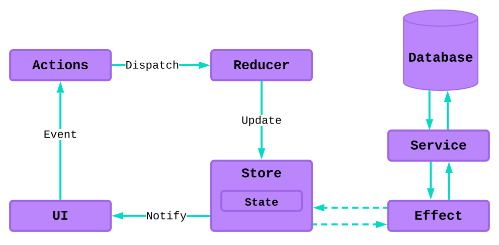

# Q05 Styling and third-party libraries

**Questions:**

- Explain and discuss responsive web design (Flexbox, Grid and media queries)
- Explain how third-party libraries can be used to develop web applications (examples: NgRx, Tailwind, and Angular Material)

## Responsive web design

Responsive web design is a way to make web applications look good on both mobile and desktop devices. Examples that can help making a responsive web design are `Flexbox`, `Grid`, and `media queries`.

### [Flexbox](./src/styles.scss)

`Flexbox` is a way to order elements automatically. There are multiple extra options that can be used to change the layout of the elements. Examples are `display:flex`, `flex-wrap: wrap`, and `flex-direction: row | column`.

### [Grid and media queries](./src/app/grid/grid.component.scss)

`Grid` is a way to order elements in a grid defined by the parent elements `grid-template` option. `Grid` alone is not very responsive though, so `media queries` can be used to make the grid responsive by changing the grid layout depending on the screen size. `media queries` can be used for a range of things, not just grid layouts. In the example a `media query` is also used to change a field depedning on the OS theme.

## Third-party libraries

Third-party libraries can be used to style web applications. Examples of third-party libraries for styling are Tailwind, Angular Material, and NgRx.

### [Tailwind](./src/app/tailwind/tailwind.component.html)

Tailwind is a CSS library that can be used to style web applications. Tailwind is very customizable and can be used to make a web application look exactly how you want it to look. Tailwind styling is applied by adding classes to the HTML elements. Each of the classes are shorthands for CSS properties.

### [Angular Material](./src/app/material/material.component.html)

Angular Material is a styling library that comes with a range of pre-styled components. It is possible to choose a pre-defined theme or make a custom theme and color palette. Angular Material is very easy to use, but not as customizable as Tailwind.

### NgRx

NgRx is a state management library for Angular. It extends Redux with side effects. NgRx is very powerful, but also very complex, can be hard to learn and requires a lot of setup and code.

You should consider using a state management system if you have these challenges:

- S - Shared State is accessed by many components and services
- H - Hydrated State that is persisted and hydrated from storage
- A - Available State that needs to be available when re-entering routes
- R - Retrieved State that needs to be retrieved with a side effect
- I - Impacted State that is impacted by actions from other sources

#### Store

The store is the single source of truth for the application state. The store is immutable and can only be changed by dispatching actions.

#### Actions

Actions define unique events that are used to change the state of the store. Actions are dispatched by components and handled by reducers.

#### Reducers

Reducers are responsible for handling state transitions in applications. Reducers are pure functions that always prooduce the same output for a given input. They handle the state transitions by taking the current state and an action as input and produce a new state as output.

#### Effects

Effects are used for side-effects like HTTP requests, timers, and local storage. They isolate the side-effects, allowing for more pure functions. Effects communicate with services. Effects may produce new Actions.
