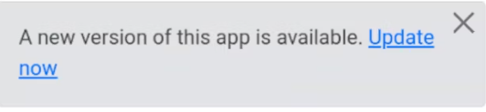

# Q06 Progressive Web Apps

<!-- References to code will be made in markdown by using: See more in line XX in [name of snippet]("PATH_TO_FILE") -->

## Introduction - What is it about / what will you talk about

**Questions:**

- Explain the concept of PWA
- Show how to implement a PWA with Angular

## What is A PWA

- **Progressive** - Works for every user, regardless of browser choice because it's built with progressive enhancement as a core tenet

- **Responsive** - Fits any form factor: desktop, mobile, tablet, or whatever is next. See more responsive web design on: [q05](https://ninjaneer127.github.io/AFE-Eksamen/q05/)

- **Connectivity** Independent - Enhanced with service workers to work offline or on
low-quality networks. See [storage](#storage) for offline use

- **App-like** - Feels like an app to the user with app-style interactions and navigation because it's built on the app shell model.

- **Fresh** - Always up-to-date thanks to the service worker update process.

- **Safe** - Served via HTTPS to prevent snooping and to ensure content hasn't been tampered with.

- **Discoverable** - Is identifiable as an "application" thanks to W3C manifest and
service worker registration scope, allowing search engines to find it.

- **Re-engageable** - Makes re-engagement easy through features like push notifications.

- **Installable** - Allows users to "keep" apps they find most useful on their home screen without the hassle of an app store.

- **Linkable** - Easily share via URL, does not require complex installation.

## Storage

To make use of an app in offline mode, it is beneficial to store data in an offline storage, such as a local (storage) database.

An example is provided where we display stored data, if any, until we load the data.

You can see how we use this in line 5 of the [cards List template](./src/app/credit-card/credit-card-list/credit-card-list.component.html). Here, we fetch the data, set the loading state, and display the stored values.

To understand how we store and retrieve the data, refer to the [cards List TS](./src/app/credit-card/credit-card-list/credit-card-list.component.ts) file.

## Implementing PWA
<!-- 
see https://hackernoon.com/building-progressive-web-application-pwa-with-angular 
 -->

We have included the installation and online status inside the Footer: 

### Make it installable

Run `ng add @angular/pwd` to add the library to set up the Angular service worker. This updates the following files:

- package.json: The `@angular/service-worker` library was added in [line 25](./package.json).
- src/app/app.module.ts: The service worker configuration was added. See line 33-39 for [Service worker registration](./src/app/app.module.ts)
- src/index.html: Manifest file configuration and theme color was added [line 18](./src/index.html)

### Check online status

An important thing is the "fresh" data vibe. This is done by using the window.navigator.online, as seen in lines 45-48 of the [code](./src/app/footer/footer.component.ts).

We also add an event listener to detect changes, as shown in [line 25](./src/app/footer/footer.component.ts).

### Update App

When the app has been "downloaded", an update notfication should be implemented.
This can be seen in [lines 28-50](./src/app/footer/footer.component.ts)
This uses the Service Worker Update from angular to update the version of the app.

We then make a popup dialog as seen here:

The implemenation of the dialog can be seen in [template lines 42-49](./src/app/footer/footer.component.html).  

### Different Devices

When making a progressive web app, there are some things we can't just make usable for every type of device, such as how to download, whether it's from an Android/Chromium device or an Apple device.

When we load the Update Module, we check for the **platform** type in the `loadModalPwa()` function.

We also do this in the template, where we look at the `modalPwaPlatform` field to differentiate between different "divs".

See [template lines 52-70](./src/app/footer/footer.component.html).  

### Additional information about Service Workers

A service worker is a web worker that implements a programmable network proxy that can respond to web/HTTP requests of the main document. It is able to check the availability of a remote server and to cache content when that server is available, and serve that content later to the document. Service workers, like any other web workers, work separately from the main document context. Service workers can handle push notifications and synchronize data in the background, cache or retrieve resource requests, intercept network requests and receive centralized updates independently of the document that registered them, even when that document is not loaded.

Service workers go through a three-step lifecycle:
 - Registration
 - Installation
 - Activation. 
 
 Registration involves telling the browser the location of the service worker in preparation for installation. 
 
 Installation occurs when there is no service worker installed in the browser for the web app, or if there is an update to the service worker.
 
  Activation occurs when all of the PWA's pages are closed, so that there is no conflict between the previous version and the updated one. The lifecycle also helps maintain consistency when switching among versions of service worker since only a single service worker can be active for a domain.

Service worker in action - inspector -> application -> service workers