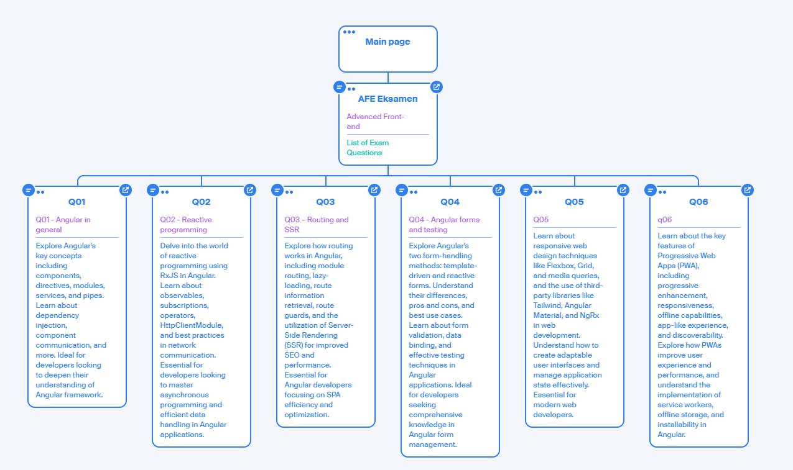

# Q08 SEO

- Explain what Search Engine Optimization is. Why and when it is important.
- What affects SEO ranking?
- What is Core Web Vitals? And why are they important?
- Give an overview of Next.js and explain how to improve SEO in a Next Web app.

## What is search egnine optimization

It's a stragegy to make sure your website is higher i google search

### Ranking

The placement of your website compared to your competetor. The higher you are on searches the more your website will be visited.

### Traffic

When we look how the seo performs we look at the trafic. How many people visit your website. And from what search terms.
However not all trafic is good. We need the trafic that is looking for our product. So there for its importent to make content that is relevant to the search. and not just make popular content.
The only exception is if you make money on ads. Then you want as much trafic as possible.

## What affects SEO ranking?

### Sitemap  

When the webcrawlers want to visit sites they can crawl through links. The primary purpose of a sitemap is to list URLs to ensure that search engines can find and crawl them. Sitemaps usually include basic information such as the URL, last modification date, change frequency, and priority of the pages on your site.

For our github-pages we made a [sitemap](./../sitemap.xml) where all the URLs are listed.

We can use this to create a visual sitemap or use in in google console to make sure google can find all the pages. and faster 
see [octopus](https://octopus.do/0slkicvjvyq9)

### Metaheader

In the header of a HTML page there can ber stored some meta data.
like in this [q03 index](./../q03/src/index.html)
The meta data tag have 4 properties: description, keywords, author, and viewport.  

```html
<meta name="description" content="This is the description of my website">
<meta name="keywords" content="keyword1, keyword2, keyword3, keyword4, etc.">

<meta name="author" content="Ninjaneer127, MathiasSchjoedt-Bavngaard, Sirety">

<meta name="viewport" content="width=device-width, initial-scale=1.0">
```

The description is used to describe the website. This is used by the search engine to describe the website. and is also used to describe the website in the search results. (this is especially important becouse this could be the first thing a user sees about your website.)


read more here:
[HTML < meta > tag](https://www.w3schools.com/tags/tag_meta.asp)

### Content

So why is content important for the search engine?
The search engine wants to give the user the best experience. Therefore it will try to give the user the best content. This is also scored by the users. If a user clicks on a link and then quickly leaves the page again, the search engine will see that the user did not find what he was looking for. This will then affect the ranking of the page. For those search terms.

### Links  

To make sure SE knows what category your website belongs to, it looks at the links of your webpage.
It will also use these links to "crawl" through a site.

#### Internal

The internal links - the links on your page that links to your own site. These links are used to calculate usability and to se what pages are connected.

#### External

The external links are both outgoing and incoming.

The outgoing links are the ones that you say your weebsite looks like. This way services like google can see what you want your website to look like.
The incoming links are other peoble that link to your website. Both the number of links affects you SEO "score" but also the correct type of links. Fx. if i own a potato buissness its good that pages that premote potatoes / vegstibles linkes to my site. Like a Health blog saying; "this is a place you can get good potatoes for your salat" is much better, than a page explaining how a atomic clock works and mentions a potato and then linking to you potato shop maybe just to link to the people who don't know what a potato is.

Now this link from the atomic power page is maybe not what your customers normaly look for. There for that link wont be as vlauable as the helth blog one.

### Performance

To get a good SEO score you need to have a good performance. This means how well your website performs. in terms of core web vitals.
The better your website performs the better your SEO score will be and higher ranking.

## Core Web Vitals

Core Web Vitals is a subset of Web Vitals, and currently consists of three metrics that measure:

- loading performance (LCP)
- interactivity (FID)
- visual stability of the page (CLS)

These mectrics are a way to measure the performance of a website and therefor also a way to measure the user experience.
Google wants to give the user the best experience.


inspect -> Lighthouse -> Analyze page load

### Loading

how long does it take to load the page. Here we look at the Largest Contentful Paint (LCP) .
This is the time it takes to load the largest element on the page.

### Interactivity

How long does it take for the page to be interactive. Here we look at the First Input Delay (FID).
This is the time it takes for the page to be interactive meaning the time it takes for the page to respond to the first user interaction. like a click or a scroll.

### Visual stability

How stable is the page. Here we look at the Cumulative Layout Shift (CLS).
This is the amount of unexpected layout shift of visual page content. This is when the page moves around. like when you are about to click a button and then a ad pops up and you click the ad instead.

When CSS is applyet late fx. Then the page will load and then the CSS will be applied. This will make the page jump around. This is not good for the user experience.

## Next.js

Next.js is an open-source web development framework for React developed by Vercel. It enables serverside rendering and static generation of websites. It works well with SEO and is very fast because of the serverside rendering. It is easy to deploy the app to Vercel.

### Next.js and SEO

Next focuses on performance by minimizing the amount of code sent to the client. It also has built in support for code splitting and prefetching. This means that only the code needed for the current page is loaded. Shared code goes in separate bundles to avoid loading the same code multiple times. After the initial load, Next starts to prefetch code for other pages in the background.

and this by using

- **Compilation** happens during development and as a part of the build step.

- **Minifying** is the process of removing unnecessary characters from the code like whitespace, comments, indents and line breaks. This reduces the size of the code and improves the application's performance.

- **Bundling** is the process of combining multiple files into optimized bundles. This reduces the number of requests needed to load the application.

#### Static generation

Static generation is the default rendering method in Next. Pages that do not need to fetch external data will automatically be statically generated at build time. It **generates HTML for each page at build time**. The HTML is then reused on each request. This is the fastest method because the HTML is already generated and ready to be served. It is also the best method for SEO because the HTML is already generated and can be indexed by search engines.

[getStaticProps](../q07/nextjs-blog/pages/posts/[id].js) can be used to fetch external data at build time and send it to the page as props. This is useful for pages that need to fetch external data but do not need to fetch data at request time.

Static gemeration is the best method for SEO because the HTML is already generated and can be indexed by search engines. But it is not always possible to use static generation. if Updated data is needed.

#### Server-side rendering

As Next.js is serverside Rendered it performs very well on SEO because the content is already rendered when the page is loaded. For crawlers this makes the page easy to read. And the content is already there. However this does give a slower first load time. and a slower TTFB. ( Time To First Byte )

#### Client-side rendering

Client-side rendering **generates HTML on the client**.  This gives fast TTBF and fast first load time. However this is not good for SEO because the content is not rendered when the page is loaded. This means that the crawlers will have a hard time reading the page.
