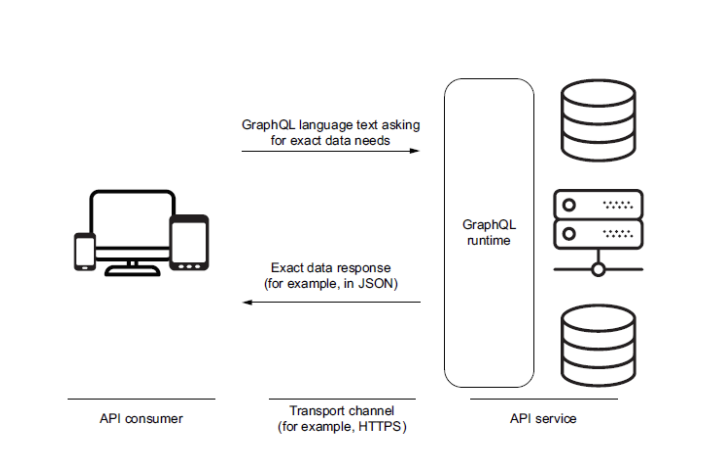

# Q09 GraphQL
<!-- References to code will be made in markdown by using: See more in line XX in [name of snippet]("PATH_TO_FILE") -->

**Questions:**

- Explain the principles of GraphQL.
- Discuss pros and cons of REST vs GraphQL.
- Show how to access a GraphQL Web API from React.
- Show how to access a GraphQL Web API from Next, and explain why it is different from doing the same in React.

## What is GraphQL

GraphQL is a query language for APIs and a runtime for fulfilling those queries with your existing data. GraphQL provides a complete and understandable description of the data in your API, gives clients the power to ask for exactly what they need and nothing more, makes it easier to evolve APIs over time, and enables powerful developer tools.

Building a GraphQL api can be more intensive than building a REST api. If your problem can be solved with a REST api, then you should use that. GraphQL is a good choice if you have a lot of different data sources, or if you have a lot of different clients that need different data.



Your GraphQL server uses a schema to describe the shape of your data graph. The schema specifies exactly which queries and mutations are
available for clients to execute against your data graph. The schema is made with the GraphQL Schema Definition Language (SDL). The schema is the contract between the client and the server. The client can only ask for what is defined in the schema.

Example of a schema:

```javascript  
type Character {
    id: ID!
    name: String!
    appearsIn: [Episode!]!
    friends: [Character]
}

type Droid {
    id: ID!
    name: String!
}

enum Episode {
    NEWHOPE
    EMPIRE
    JEDI
}

type Query {
    hero(episode: Episode): Character
    droid(id: ID!): Droid
}
```

The structure of a GraphQL query is threefold. It contains three fields: Document, Variables and Meta-Information.
There are three different types of operations: Query (simple read), Mutation (write followed by a read) and Subscription (request real time data updates).

An example of a GraphQL query and response can be seen in the following snippets:

```javascript
// Query
{
    hero(episode: NEWHOPE) {
        name
        friends {
            name
        }
    }
}

```

In this query we are asking for the name of the hero and the names of the heroes friends. The response will look like this:

```javascript
// Response
    {
        "data": {
            "hero": {
                "name": "R2-D2",
                "friends": [
                    {
                        "name": "Luke Skywalker"
                    },
                    {
                        "name": "Han Solo"
                    },
                    {
                        "name": "Leia Organa"
                    }
                ]
            }
        }
    }
```

Unless an error occurs with the request. Then the response will look something like this:

```javascript
// Response
    {
        "errors": [
            {
                "message": "Name for character with ID 1002 could not be fetched.",
                "locations": [
                    {
                        "line": 6,
                        "column": 7
                    }
                ],
                "path": [
                    "hero",
                    "friends",
                    1,
                    "name"
                ]
            }
        ]
    }
```

With GraphQL we only get exactly what we ask for and nothing more. This means that we can avoid overfetching and underfetching and don't have to make multiple requests to get the data we need or start filtering the data on the client side.

## Apollo Client

Apollo Client is a comprehensive state management library for JavaScript that enables you to manage both local and remote data with GraphQL. Use it to fetch, cache, and modify application data, all while automatically updating your UI.
